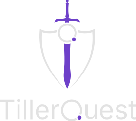

# Unity Game Hub

**A Unity-based TillerQuest game launcher with secure OAuth 2.0 authentication**

TillerQuest Game Hub is a centralized access point for the TillerQuest universe. Players log in once through secure device authorization, then access multiple games and apps from a unified interface. This project provides a scalable, maintainable architecture for adding new games and applications, connected to the TillerQuest system.

**Accessing the games can be done through a build (.exe), and players do not need to install and setup this project.**

> Contributions are welcome, but please ask a game master for further information on how to do so.

## Project Overview

### Key Features

- **Secure Authentication** - OAuth 2.0 Device Authorization Flow (RFC 8628)
- **Encrypted Token Storage** - DPAPI on Windows, AES-256 on other platforms
- **Persistent Sessions** - Tokens survive app restarts
- **Multiple Games and Apps** - Easily add new games and apps as scenes
- **Player Profile System** - Centralized progress tracking
- **Scene Management** - Smooth transitions with loading screens
- **Production-Ready** - HTTPS enforcement, error handling, automatic token refresh
